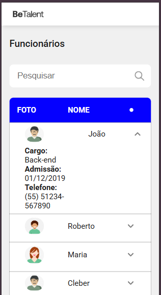

# Teste Técnico Frontend BeTalent

O Teste Técnico segue a estrutura e o design do projeto apresentados no Figma.

## Tecnologias Utilizadas:

React.js
Git e  GitHub
Node.js
Yarn
json-server 

## Apresentação:
Imagem do projeto, seguindo o design do figma:



Imagem do projeto responsivo, seguindo o maximo o design do figma:
## ⚙️ Instalação:
Clone o repositório e instale as dependências:
```bash
git clone https://github.com/hbruunno/TesteTecnicoFrontendBeTalent.git
cd teste-pratico-frontend
npm install
```

## 🚀 Rodando o Projeto
Para rodar executar o servidor banco de dados:
```bash
npx json-server --watch db.json
```
Execultar o projeto:
```bash
yarn dev
```
## Desafios:

Um dos principais desafios foi lidar com a estrutura da tabela, não apenas com a tabela em si, mas principalmente com a sua responsividade. Para garantir que a tabela se adaptasse bem a diferentes tamanhos de tela, utilizei CSS para ocultar algumas informações em dispositivos menores, proporcionando uma visualização mais fluida e agradável.

Além disso, ao formatar datas e números, consultei documentos e referências para garantir que os valores fossem apresentados corretamente de acordo com o formato necessário, implementando as funções necessárias nos códigos.
